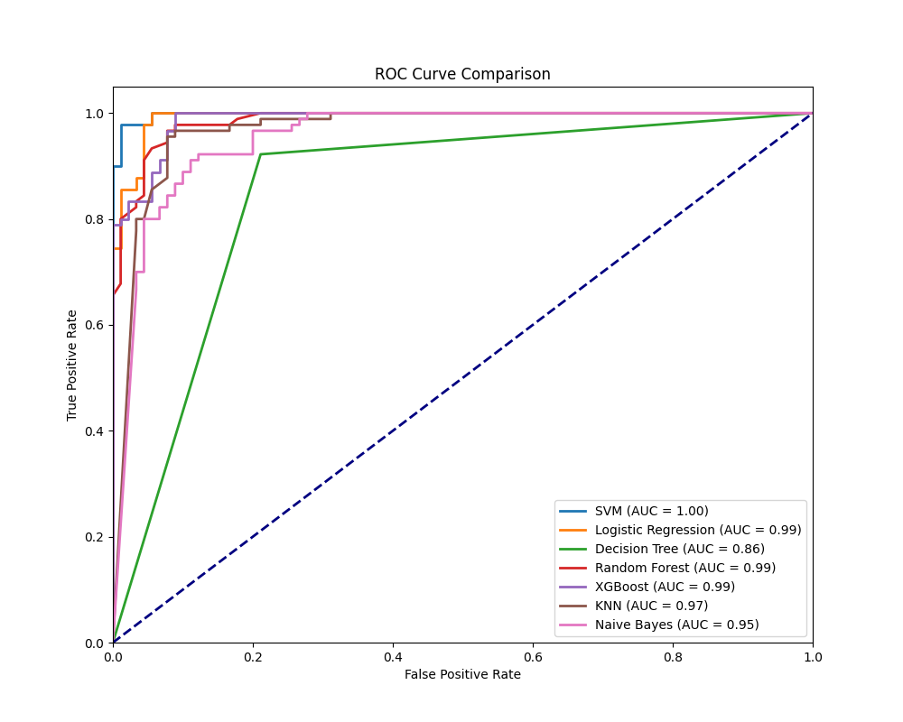

>本项目是一个NLP实践和分类的项目，项目数据集来源是ChatGPT

## Setup

### Data Preparation


Data.txt文件是初始数据文件，未做改动


### Pretrained Models


model使用谷歌的预训练模型[Word2Vector](https://code.google.com/archive/p/word2vec/)，应该放在`./Model` directory.

### Environment Setup

```
sh install.sh
```


### 运行

直接打开model.py运行即可

---

## 具体流程

1. 将[Data.txt](https://github.com/Anonymi1ty/ML_Project/blob/main/Data.txt)文件进行读取，得到Safe和Unsafe的Dataset放入RowData中
2. 准备好谷歌预训练model，准备微调，构建语料库
   - 数据预处理
     - 去除标点符号，如句号、逗号等。 
     - 统一大小写（一般建议转为小写，以避免区分大小写的影响）。 
     - 去除停用词（如“the”、“is”等不太有意义的词）。 
     - 分词
   - 将预处理结果合并在一个sentences中
3. 微调模型`mixed_word2vec.model`，存储在Model目录下（仅保留语料中出现的词）
4. 使用微调模型，将预处理后的数据转化为300d的向量，并且将整个文章转化为Vector（使用平均值加和的方式）`data_vectors.npy`，打上label标签`data_labels.npy`


## 具体报告

[飞书](https://icnir26y0hx8.feishu.cn/wiki/LE03w6B6ziYLSHkduI1cHty5nrh?from=from_copylink)


### 结果

ROC曲线

